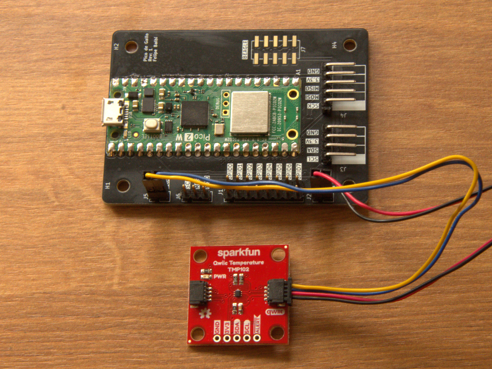

# Writing A Device Driver

For this short introduction to writing devices drivers in Rust and
verifying with *Pico de Gallo*, we are targeting the TMP102
I<sup>2</sup>C Temperature Sensor. Its datasheet is available online
in both [pdf](https://www.ti.com/lit/gpn/tmp102) and
[html](https://www.ti.com/document-viewer/tmp102/datasheet) formats.

Like many other temperature sensors from the *TMP* family, this device
is very straightforward. Temperatures are reported with 12-bits of
dynamic range with each bit representing 0.0625℃. There is a simple
linear formula to convert raw ADC values to degrees celsius.

With its low 0.35µA shutdown current, this sensor is suitable for
battery powered applications of all kinds.

## Exploring the device with `gallo` app

Before committing to writing a full driver, we can make sure we
understand how the device works by exploring it with the `gallo`
app. For the purposes of this document, we are using [Sparkfun's
Digital Temperature Sensor - TMP102
(Qwiic)](https://www.sparkfun.com/sparkfun-digital-temperature-sensor-tmp102-qwiic.html)
breakout board.

The [qwiic documentation](https://www.sparkfun.com/qwiic) confirms the
pin assignment used on their JST connector, which we replicate here:

| **Pin** | **Color** | **Signal** |
|---------|-----------|------------|
| 1       | Black     | Ground     |
| 2       | Red       | 3.3V       |
| 3       | Blue      | SDA        |
| 4       | Yellow    | SCL        |

Let's wire up the board to *Pico de Gallo* and `scan` the bus:



```console
$ gallo i2c scan
╭────┬────┬────┬────┬────┬────┬────┬────┬────┬────┬────┬────┬────┬────┬────┬────┬────╮
│    │  0 │  1 │  2 │  3 │  4 │  5 │  6 │  7 │  8 │  9 │  a │  b │  c │  d │  e │  f │
├────┼────┼────┼────┼────┼────┼────┼────┼────┼────┼────┼────┼────┼────┼────┼────┼────┤
│ 0  │ RR │ RR │ RR │ RR │ RR │ RR │ RR │ RR │ -- │ -- │ -- │ -- │ -- │ -- │ -- │ -- │
│ 1  │ -- │ -- │ -- │ -- │ -- │ -- │ -- │ -- │ -- │ -- │ -- │ -- │ -- │ -- │ -- │ -- │
│ 2  │ -- │ -- │ -- │ -- │ -- │ -- │ -- │ -- │ -- │ -- │ -- │ -- │ -- │ -- │ -- │ -- │
│ 3  │ -- │ -- │ -- │ -- │ -- │ -- │ -- │ -- │ -- │ -- │ -- │ -- │ -- │ -- │ -- │ -- │
│ 4  │ -- │ -- │ -- │ -- │ -- │ -- │ -- │ -- │ 48 │ -- │ -- │ -- │ -- │ -- │ -- │ -- │
│ 5  │ -- │ -- │ -- │ -- │ -- │ -- │ -- │ -- │ -- │ -- │ -- │ -- │ -- │ -- │ -- │ -- │
│ 6  │ -- │ -- │ -- │ -- │ -- │ -- │ -- │ -- │ -- │ -- │ -- │ -- │ -- │ -- │ -- │ -- │
│ 7  │ -- │ -- │ -- │ -- │ -- │ -- │ -- │ -- │ RR │ RR │ RR │ RR │ RR │ RR │ RR │ RR │
╰────┴────┴────┴────┴────┴────┴────┴────┴────┴────┴────┴────┴────┴────┴────┴────┴────╯
```

A new device responds on address `0x48`, looking through TMP102
datasheet, we find out, in table 6-4, that this device is supposed to
respond to one of four different addresses depending on how pin `A0`
was wired:

| **A0** | **Address** |
|--------|-------------|
| Ground | `0x48`      |
| V+     | `0x49`      |
| SDA    | `0x4a`      |
| SCL    | `0x4b`      |

Sparkfun must have routed `A0` to ground. We can confirm this by
looking through [Sparkfun's TMP102
schematics](https://cdn.sparkfun.com/assets/d/1/6/7/4/SparkFun_TMP102_Qwiic-Schematic.pdf)
where we find jumpers `JP1` and `JP2` used for selecting the state of
`A0` pin. It comes from the factory with `A0` routed to ground, as we
expected.

Section 6.5.3.6 of the datasheet specifies that setting bit 7 of first
byte of the configuration register initiates a one-shot
conversion. Additionally, figure 6-2 specifies how to access any of
the four registers. We start by sending the target device address
&mdash; in our case, `0x48` &mdash;, followed by the pointer register
byte, and, finally, 2 bytes of register data, MSB first. Table 6-7
defines the valid values for the pointer register byte, reproduced
below for convenience:

| **P1** | **P0** | **Register**                           |
|--------|--------|----------------------------------------|
| 0      | 0      | Temperature Register (read-only)       |
| 0      | 1      | Configuration register (read-write)    |
| 1      | 0      | T<sub>LOW</sub> register (read-write)  |
| 1      | 1      | T<sub>HIGH</sub> register (read-write) |

We want to set bit 7 without modifying the other bits. This is
commonly referred to as a *read-modify-write* operation. However, for
the sake of simplicity we will check the power-on reset value of the
configuration register in tables 6-10 and 6-11, modify bit 7 or byte 1
and write the resulting value.

Reset state for configuration register is as shown below:

|            | **B7** | **B6** | **B5** | **B4** | **B3** | **B2** | **B1** | **B0** |
|------------|--------|--------|--------|--------|--------|--------|--------|--------|
| **Byte 1** | 0      | 1      | 1      | 0      | 0      | 0      | 0      | 0      |
| **Byte 2** | 1      | 0      | 1      | 0      | 0      | 0      | 0      | 0      |

In other words, to set bit 7 of byte 1 of Configuration register we
must use a `write` operation for address `0x48`, with a write of
`0x01 0xe0 0xa0`:

```console
$ gallo i2c write --address 0x48 --bytes 0x01 0xe0 0xa0
```

The resulting temperature will be in the Temperature register. To
access this one we need a `write-read` operation that will select
temperature register with the pointer byte and follow that with a read
of 2 bytes:

```console
$ gallo i2c write-read --address 0x48 --bytes 0x00 --count 2
6b 15
```

Converting this raw ADC conversion using the details of the datasheet,
we get:

$$ \frac{5843 \cdot 0.0625}{16} = \frac{342.6875}{16} \approx
21.4^\circ\text{C} $$

At this point, we should be fairly confident that we understand enough
of how the device works to start writing a real embedded rust
driver. Let's move on to the next section.

## Scaffolding the driver crate

Rust's `cargo` tool does a lot of the manual work for us. Let's create
a new library crate and add a few necessary dependencies.

```console
$ cargo new --lib tmp102
    Creating library `tmp102` package
```

Justs a couple files are created:

```console
Cargo.toml
src\
src\lib.rs
```

We will add our driver code to `lib.rs`, but before that we know we
will need `embedded-hal`, `embedded-hal-async`, and `device-driver`
crates as dependencies. Additionaly, we will bring `pico-de-gallo-hal`
as a dev-dependency, therefore:

```console
$ cargo add embedded-hal
    Updating crates.io index
      Adding embedded-hal v1.0.0 to dependencies
             Features:
             - defmt-03
$ cargo add embedded-hal-async
    Updating crates.io index
      Adding embedded-hal-async v1.0.0 to dependencies
             Features:
             - defmt-03
$ cargo add device-driver --no-default-features -F toml
    Updating crates.io index
      Adding device-driver v1.0.7 to dependencies
             Features:
             + _macros
             + toml
             - defmt-03
             - dsl
             - json
             - yaml
    Updating crates.io index
     Locking 65 packages to latest Rust 1.90.0 compatible versions
      Adding winnow v0.6.24 (available: v0.6.26)
$ cargo add --dev pico-de-gallo-hal --git https://github.com/OpenDevicePartnership/pico-de-gallo
    Updating git repository `https://github.com/OpenDevicePartnership/pico-de-gallo`
      Adding pico-de-gallo-hal (git) to dev-dependencies
cargo add --dev tokio -F rt-multi-thread,time
    Updating crates.io index
      Adding tokio v1.47.1 to dev-dependencies
             Features:
             + rt
             + rt-multi-thread
             + time
             - bytes
             - fs
             - full
             - io-std
             - io-util
             - libc
             - macros
             - mio
             - net
             - parking_lot
             - process
             - signal
             - signal-hook-registry
             - socket2
             - sync
             - test-util
             - tokio-macros
             - tracing
             - windows-sys
```

Our `Cargo.toml` file should look like the one below:

```
[package]
name = "tmp102"
version = "0.1.0"
edition = "2024"

[dependencies]
device-driver = { version = "1.0.7", default-features = false, features = ["toml"] }
embedded-hal = "1.0.0"
embedded-hal-async = "1.0.0"

[dev-dependencies]
pico-de-gallo-hal = { git = "https://github.com/OpenDevicePartnership/pico-de-gallo" }
tokio = { version = "1.47.1", features = ["rt-multi-thread", "time"] }
```

We will rely on `device-driver-cli` to generate some code for us based
on a `toml` file we will write. So let's install that one too:

```console
$ cargo install device-driver-cli
    Updating crates.io index
  Downloaded device-driver-cli v1.0.7
  Downloaded 1 crate (8.4KiB) in 0.27s
  Installing device-driver-cli v1.0.7
    Updating crates.io index
     Locking 86 packages to latest compatible versions
      Adding winnow v0.6.24 (available: v0.6.26)
  Downloaded anstream v0.6.21
  Downloaded serde_core v1.0.228
  Downloaded anstyle v1.0.13
  Downloaded quote v1.0.41
  Downloaded serde v1.0.228
  Downloaded 5 crates (220.1KiB) in 1.89s
[...]
   Installed package `device-driver-cli v1.0.7` (executable `device-driver-cli`)
```

## Describing the device using the `toml` file

Create a new `tmp102.toml` file at the root of your crate. We will
describe all registers and their contents within this file.
We start with the `config` section, like so:

```toml
[config]
register_address_type = "u8"
default_byte_order = "LE"
name_word_boundaries = ["Hyphen"]
```

This tells `device-driver-cli` that all registers are addressed by a
single byte and the response byte order is *big-endian*. Because
TMP112 only has four registers, our `toml` manifest file will be
rather short. Let's add the temperature register:

```toml
[Temperature]
type = "register"
address = 0
size_bits = 16
access = "RO"
description = "Temperature register"
```

Here we're telling `device-driver-cli` that this device has a
read-only Temperature register at address 0 and the register is
16-bits wide.

Let's add the remaining three registers:

```toml
[Configuration]
type = "register"
address = 1
size_bits = 16
access = "RW"
description = "Configuration register"

[Tlow]
type = "register"
address = 2
size_bits = 16
access = "RW"
description = "T-low register"

[Thigh]
type = "register"
address = 3
size_bits = 16
access = "RW"
description = "T-high register"
```

While this is sufficient, we can also define the various fields within
the Configuration register such that we can some more type-safety for
free. Let's do so:

```toml
[Configuration.fields.SD]
description = "Shutdown mode"
base = "uint"
start = 0
end = 1

[Configuration.fields.SD.conversion]
name = "shutdown-mode"
description = "Shutdown mode"
running = 0
power-off = 1

[Configuration.fields.TM]
description = "Thermostat mode"
base = "uint"
start = 1
end = 2

[Configuration.fields.TM.conversion]
name = "thermostat-mode"
description = "Thermostat mode of operation"
comparator = 0
interrupt = 1

[Configuration.fields.POL]
description = "Alert pin polarity"
base = "uint"
start = 2
end = 3

[Configuration.fields.POL.conversion]
name = "Polarity"
description = "Alert pin polarity"
active-low = 0
active-high = 1

[Configuration.fields.F]
description = "Fault queue"
base = "uint"
start = 3
end = 5

[Configuration.fields.F.conversion]
name = "fault-queue"
description = "Fault queue depth"
_1 = 0
_2 = 1
_4 = 2
_6 = 3

[Configuration.fields.R]
description = "Resolution"
access = "RO"
base = "uint"
start = 5
end = 7

[Configuration.fields.OS]
description = "One-shot"
base = "bool"
start = 7
end = 8

[Configuration.fields.EM]
description = "extended-mode"
base = "uint"
start = 12
end = 13

[Configuration.fields.EM.conversion]
name = "extended-mode"
description = "Extended mode"
disable = 0
enable = 1

[Configuration.fields.AL]
description = "Alert"
base = "bool"
start = 13
end = 14

[Configuration.fields.CR]
description = "Conversion rate"
base = "uint"
start = 14
end = 16

[Configuration.fields.CR.conversion]
name = "conversion-rate"
description = "Conversion rate"
_0_25Hz = 0
_1Hz = 1
_4Hz = 2
_8Hz = 3
```

## Generating the code from our `toml` manifest

With a completed manifest file, we can let `device-driver-cli` handle
a lot of the work for us. Time to generate some code:

> [!TIP]
>
> We're placing the auto-generated code onto a separate file. The idea
> is that we will build a more ergonomic API on top of what
> `device-driver-cli` generates for us.

```console
$ device-driver-cli -m tm102.toml -d Inner -o src\inner.rs
```

If everything ran without any errors, we should have a fairly
extensive `inner.rs` which needs only some minor work to get it
working.

## Implementing `RegisterInterface` and `AsyncRegisterInterface`

We must implement `RegisterInterface` and `AsyncRegisterInterface` for
our driver to function correctly. In order to do that, we must create
a private `Interface` structure that will own the underlying
I<sup>2</sup>C bus representation. While at that, it's wise to make
sure the user is unable to pass an invalid address for our TMP102
device. We know all four addresses that can be used, so let's
represent them with a rust `enum`:

```rust,noplayground
/// A0 pin logic level representation.
#[derive(Debug)]
pub enum A0 {
    /// A0 tied to GND (default).
    Gnd,
    /// A0 tied to V+.
    Vplus,
    /// A0 tied to SDA.
    Sda,
    /// A0 tied to SCL.
    Scl,
}
```

And we add a `Default` implementation and a conversion to `u8` for
convenience:

```rust,noplayground
impl Default for A0 {
    fn default() -> Self {
        Self::Gnd
    }
}

impl From<A0> for u8 {
    fn from(connection: A0) -> Self {
        match connection {
            A0::Gnd => 0b100_1000,
            A0::Vplus => 0b100_1001,
            A0::Sda => 0b100_1010,
            A0::Scl => 0b100_1011,
        }
    }
}
```

With those in place, we can add our `Interface` declaration and its
constructor to `lib.rs`:

```rust,noplayground
struct Interface<I2C: I2c> {
    i2c: I2C,
    addr: u8,
}

impl<I2C: I2c> Interface<I2C> {
    /// Create a new Interface instance.
    fn new(i2c: I2C, a0: A0) -> Self {
        Self {
            i2c,
            addr: a0.into(),
        }
    }
}
```

Now we can impl `AsyncRegisterInterface`, like so:

```rust,noplayground
use embedded_hal_async::i2c::{Error, ErrorKind, I2c};

impl<I2C: AsyncI2c> AsyncRegisterInterface for Interface<I2C> {
    type Error = ErrorKind;
    type AddressType = u8;

    async fn write_register(
        &mut self,
        address: Self::AddressType,
        _size_bits: u32,
        data: &[u8],
    ) -> Result<(), Self::Error> {
        let mut buf = [0; 3];

        buf[0] = address;
        buf[1..].copy_from_slice(data);

        self.i2c.write(self.addr, &buf).await.map_err(|e| e.kind())
    }

    async fn read_register(
        &mut self,
        address: Self::AddressType,
        _size_bits: u32,
        data: &mut [u8],
    ) -> Result<(), Self::Error> {
        self.i2c
            .write_read(self.addr, &[address], data)
            .await
            .map_err(|e| e.kind())
    }
}
```

It should be fairly easy to understand what's happening here, but
we're just converting the register access request originating from
code generated by `device-driver-cli` into actual I<sup>2</sup>C
accesses.

With this, the driver is technically functional, but there should be a
few warnings for unused functions, let's see them. Run the compiler
and look at the output:

```console
$ cargo build
   Compiling tmp102 v0.1.0 (D:\workspace\pico-de-gallo\tmp\tmp102)
warning: field `inner` is never read
  --> src\lib.rs:52:5
   |
51 | pub struct Tmp102<I2C: I2c> {
   |            ------ field in this struct
52 |     inner: Inner<Interface<I2C>>,
   |     ^^^^^
   |
   = note: `#[warn(dead_code)]` on by default

warning: fields `interface` and `base_address` are never read
 --> src\inner.rs:5:16
  |
4 | pub struct Inner<I> {
  |            ----------- fields in this struct
5 |     pub(crate) interface: I,
  |                ^^^^^^^^^
...
8 |     base_address: u8,
  |     ^^^^^^^^^^^^
  |
  = note: `Inner` has a derived impl for the trait `Debug`, but this is intentionally ignored during dead code analysis

warning: multiple methods are never used
   --> src\inner.rs:21:19
    |
 11 | impl<I> Inner<I> {
    | ---------------------- methods in this implementation
...
 21 |     pub(crate) fn interface(&mut self) -> &mut I {
    |                   ^^^^^^^^^
...
 40 |     pub fn read_all_registers(
    |            ^^^^^^^^^^^^^^^^^^
...
 81 |     pub async fn read_all_registers_async(
    |                  ^^^^^^^^^^^^^^^^^^^^^^^^
...
109 |     pub fn temperature(
    |            ^^^^^^^^^^^
...
126 |     pub fn configuration(
    |            ^^^^^^^^^^^^^
...
147 |     pub fn tlow(
    |            ^^^^
...
161 |     pub fn thigh(
    |            ^^^^^

warning: enum `FieldSetValue` is never used
   --> src\inner.rs:882:14
    |
882 |     pub enum FieldSetValue {
    |              ^^^^^^^^^^^^^

warning: `tmp102` (lib) generated 4 warnings
    Finished `dev` profile [unoptimized + debuginfo] target(s) in 0.36s
```

## Implementing a higher level API

Our users are mainly concerned with monitoring temperatures, so if we
can make the API higher level and safer to use, everybody wins. To put
it another way, when writing rust drivers, we want to **make invalid
states unrepresentable** such that the user is incapable of
accidentally placing our device in an unknown state.

We can expect a few simple APIs:

1. `configure()` to set configuration parameters such as enabling
   extended mode, or changing the conversion rate
2. `set_high_limit()` and `set_low_limit()` to configure alert limits
   within the sensor
3. `temperature()` for reading the current temperature in Celsius
4. `continuous()` to continuously read the latest temperature
5. `shutdown()` and `run()` to, respectively, enter and exit low power
   mode
   
To reduce the amount of arguments passed to the `configure()`, we
define a `Config` structure and implement `Default` for it, as shown
below:

```rust,noplayground
/// Tmp102 configuration parameters
#[derive(Clone, Copy, Debug)]
pub struct Config {
    thermostat_mode: ThermostatMode,
    polarity: Polarity,
    extended_mode: ExtendedMode,
    conversion_rate: ConversionRate,
}

impl Default for Config {
    fn default() -> Self {
        Self {
            thermostat_mode: ThermostatMode::Comparator,
            polarity: Polarity::ActiveLow,
            extended_mode: ExtendedMode::Disable,
            conversion_rate: ConversionRate::_4hz,
        }
    }
}
```

Finally, here's the remainder of the higher-level API changes:

```rust,noplayground
impl<I2C: I2c> Tmp102<I2C> {
    const RAW_TO_CELSIUS: f32 = 0.0625;

    /// Configure device parameters.
    pub async fn configure(&mut self, config: Config) -> Result<(), ErrorKind> {
        self.extended_mode = config.extended_mode == ExtendedMode::Enable;

        self.inner
            .configuration()
            .modify_async(|r| {
                r.set_tm(config.thermostat_mode);
                r.set_pol(config.polarity);
                r.set_em(config.extended_mode);
                r.set_cr(config.conversion_rate);
            })
            .await
    }

    /// Shutdown sensor to conserve power
    pub async fn shutdown(&mut self) -> Result<(), ErrorKind> {
        self.inner
            .configuration()
            .modify_async(|r| r.set_sd(ShutdownMode::PowerOff))
            .await
    }

    /// Set sensor to always running mode
    pub async fn run(&mut self) -> Result<(), ErrorKind> {
        self.inner
            .configuration()
            .modify_async(|r| r.set_sd(ShutdownMode::Running))
            .await
    }

    /// Set temperature low limit.
    pub async fn set_low_limit(&mut self, limit: f32) -> Result<(), ErrorKind> {
        self.inner
            .tlow()
            .write_async(|w| {
                let raw = limit / Self::RAW_TO_CELSIUS;
                let raw = ((raw * 16.0) as i16).to_be_bytes();

                *w = raw.into();
            })
            .await?;
        Ok(())
    }

    /// Set temperature high limit.
    pub async fn set_high_limit(&mut self, limit: f32) -> Result<(), ErrorKind> {
        self.inner
            .thigh()
            .write_async(|w| {
                let raw = limit / Self::RAW_TO_CELSIUS;
                let raw = ((raw * 16.0) as i16).to_be_bytes();

                *w = raw.into();
            })
            .await?;
        Ok(())
    }

    /// Read current temperature in Celsius
    pub async fn temperature(&mut self) -> Result<f32, ErrorKind> {
        let mut temp = i16::from_be_bytes(self.inner.temperature().read_async().await?.into());

        if self.extended_mode {
            temp /= 8;
        } else {
            temp /= 16;
        }

        let temp = (temp as f32) * Self::RAW_TO_CELSIUS;
        Ok(temp)
    }

    /// Initiate continuous conversions
    ///
    /// # Errors
    ///
    /// `I2C::Error` when the I2C transaction fails
    pub async fn continuous<F, Fut>(&mut self, f: F) -> Result<(), ErrorKind>
    where
        F: FnOnce(&mut Self) -> Fut,
        Fut: Future<Output = Result<(), ErrorKind>> + Send,
    {
        self.run().await?;
        f(self).await?;
        self.shutdown().await
    }
}
```

With that in place, we have a respectable first draft of our driver in
about 250 lines of code. The driver is asynchronous and provides a lot
of type-safety guarantees. We should be able to integrate it with
*Pico de Gallo* next.

## Integrating with *Pico de Gallo*

Start by creating a new `examples` directory in our driver repository:

```console
$ mkdir examples
```

Each file within this directory will be able to use anything defined
by the driver, including its dependencies and, more importantly, dev
dependencies.

Here's how we would read a one-shot conversion from TMP102 using *Pico
de Gallo*.

> [!NOTE]
>
> Place the code below under e.g. `examples/one-shot.rs`. `cargo` will
> be able to run this file for us.

```rust,noplayground
use pico_de_gallo_hal::Hal;
use tmp102::*;

#[tokio::main]
async fn main() {
    let hal = Hal::new();
    let i2c = hal.i2c();

    let mut tmp = Tmp102::new_with_a0_gnd(i2c);
    let temperature = tmp.temperature().await.unwrap();
    println!("Temperature: {:.1} C", temperature);
}
```

This example can be executed with the following `cargo` command:

```console
$ cargo run --example one-shot
Temperature 21.4 C
```
