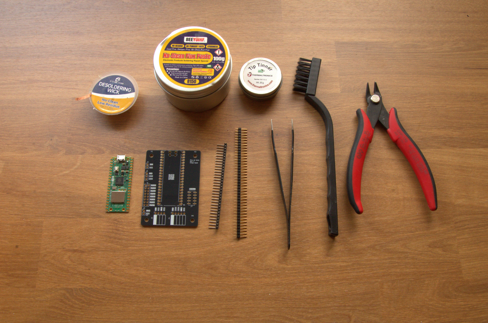
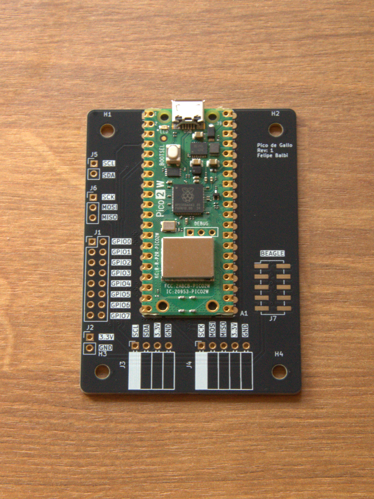
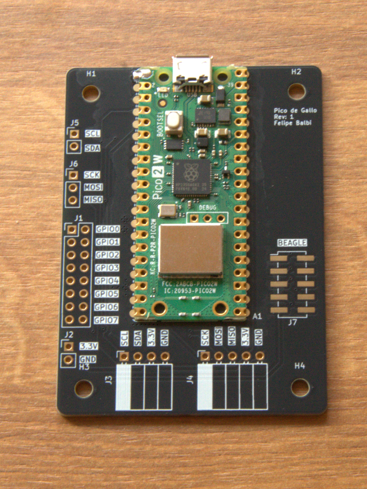
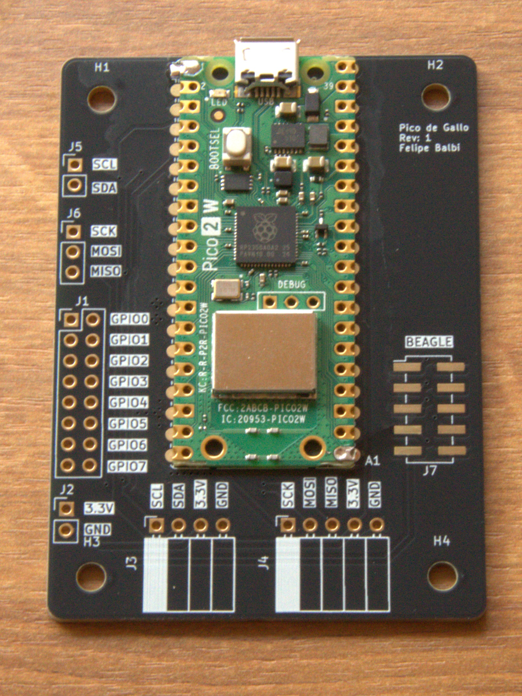
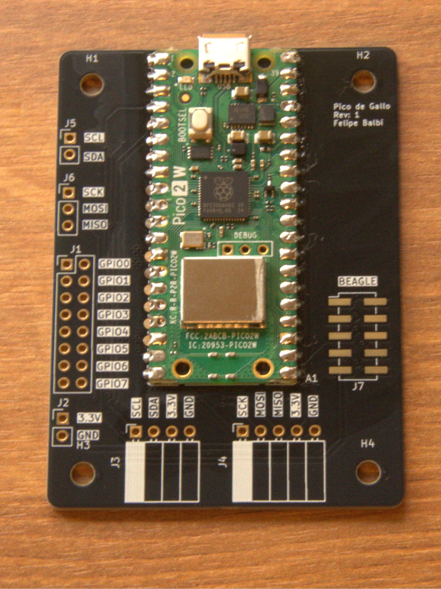
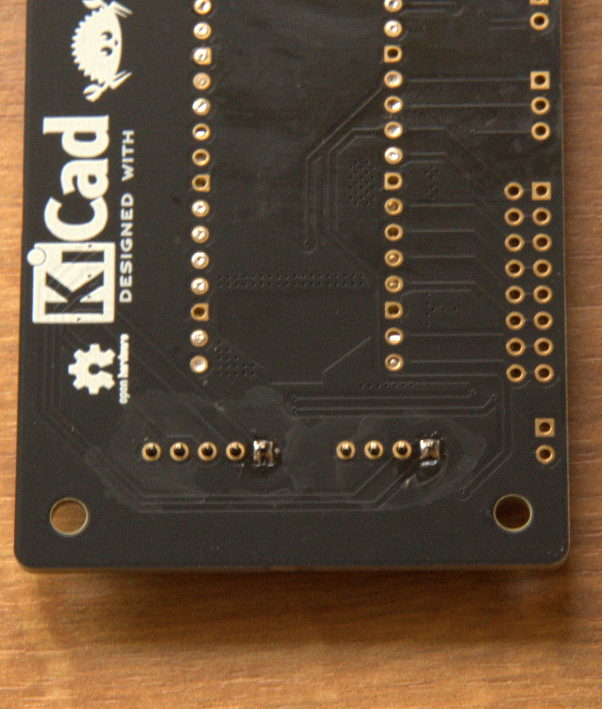
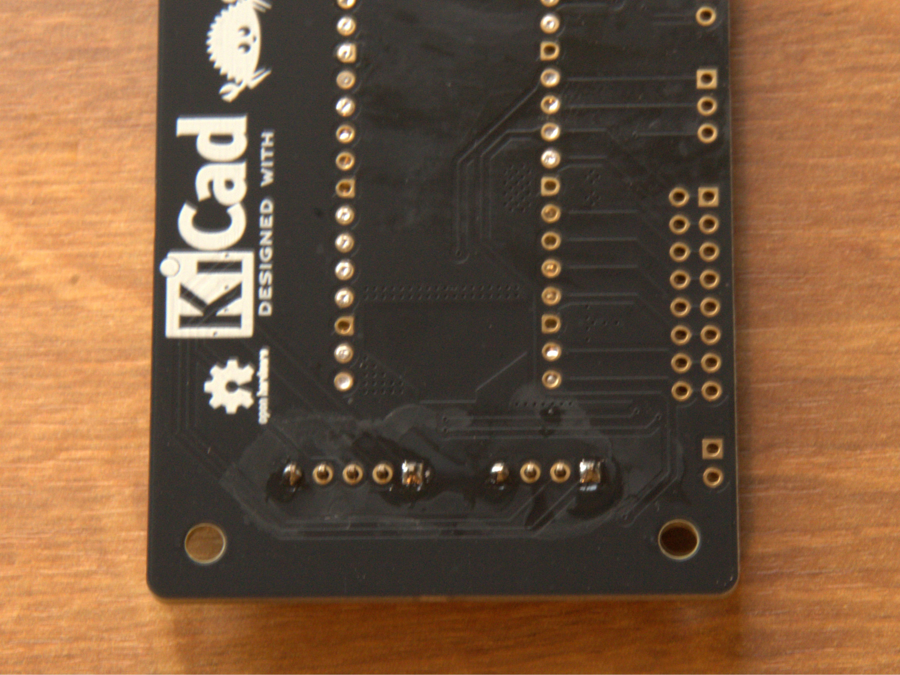
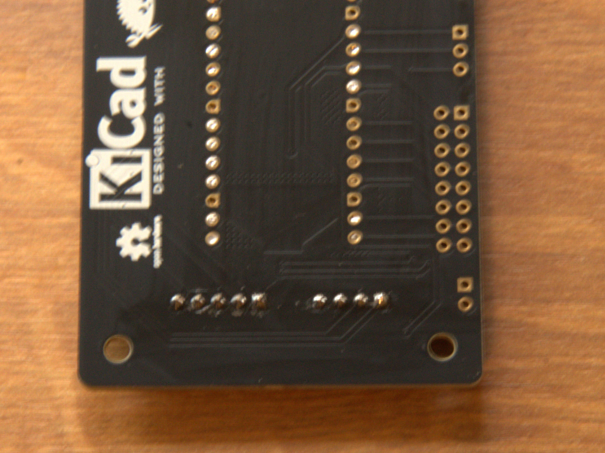
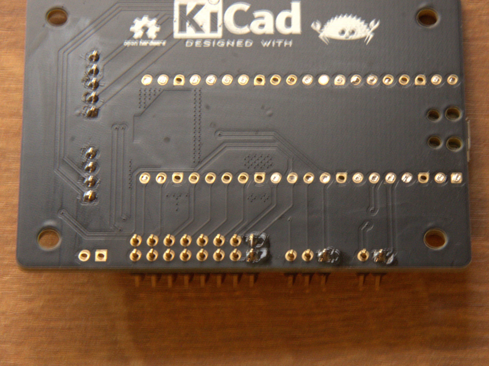
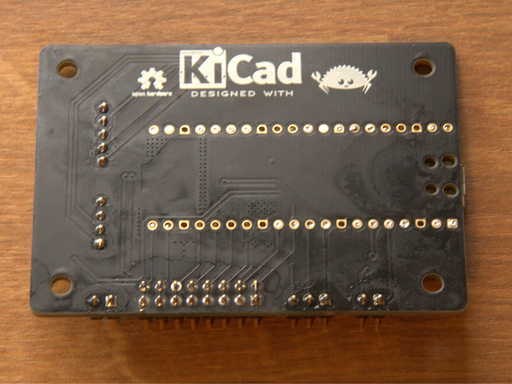

# Getting Started

There are just a few steps needed in order to get a functioning *Pico
de Gallo* on your hands:

1. Fabricate the landing board
2. Solder components
3. Flash latest Firmware

We will look at the each in the following sections, but first we need
to discuss materials and equipment needed to assemble a *Pico de
Gallo* PCB.

## Equipment and materials

1. Soldering iron or soldering station
2. Solder wire spool
3. Soldering iron tip cleaner (either sponge or brass will work)
4. Good quality no-clean liquid flux
5. Raspberry pi Pico 2 board
6. *Pico de Gallo* landing board
7. ESD-safe cleaning brushes
8. (Optional) PCB holder or *helping hands*
9. (Optional) Soldering iron tip tinner

## PCB Fabrication

There are several suitable PCB fabrication services which can consume
our Gerbers and produce high quality PCBs delivered to your door. You
are free to choose whichever your want.

**DISCLAIMER: we are not responsible for anything related to PCB
fabrication. Any costs, mistakes, damages associated with it are your
responsibility.**

Our gerbers are hosted in the
[Releases](https://github.com/OpenDevicePartnership/pico-de-gallo/releases)
page for our [Github
repository](https://github.com/OpenDevicePartnership/pico-de-gallo). For
convenience, [here's the
link](https://github.com/OpenDevicePartnership/pico-de-gallo/releases/tag/hardware-v0.1.0)
to the latest Gerber release at the time of this writing.

For most of these PCB fabrication services, you can just upload the
`gerbers.zip` file downloaded from our Hardware release above, select
your desired silk screen color, solder mask color, and surface finish
and place the order. Once the boards are ready, they should be mailed
to your door.

## Soldering Components

> [!TIP]
>
> Soldering takes practice. Before starting make sure you have all
> necessary equipment and materials around you and no unnecessary
> obstructions.
>
> Make sure that the tip of your soldering iron touches both
> components being soldered together. That is, if you're soldering the
> Pico 2 to the landing board, the iron tip should touch both the pico
> 2 and the landing board's pad at the same time.
>
> Let the area heat up for a couple seconds before introducing the
> solder wire.

When soldering, it's wise to start with the lowest height components
first. In the case of *Pico de Gallo*, that will be the Pico 2
itself.

Here are some of materials and equipment necessary:



### Soldering the Pico 2

Place the Pico 2 onto the landing board aligning the edge of
the Pico 2 board to the edge of the landing board as shown below:



Start by soldering one and only one corner pad:



This will allow you to reflow &mdash; that is, remelt &mdash; the
solder and move the board around in case it doesn't exactly align with
the other pads.

> [!TIP]
>
> Solder flux makes the process of soldering these components a lot
> easier. Grab some no-clean flux, spread around the pads and the
> solder will be *pulled onto* the pads by surface tension.
>
> As it turns out, solder really likes to stick to exposed copper and
> truly despises solder mask.

Once you align the board correctly &mdash; see the example below
&mdash;, you can move on to the opposite corner. This will help
prevent any further movement during the remainder of the soldering
process.



At this point you are ready to solder all remaining pads. The landing
board and pico 2 should be strongly attached to one another as shown
below:



### Soldering right angle headers

Next, you should move on to the right angle headers. These a bit
tricky to solder, but with some patience and, perhaps, a piece of
Polyimide Electrical Tape &mdash; also known as *Kapton Tape* &mdash;
to hold the headers while you solder, should make the process a little
easier.

Similarly to how we soldered the pico 2 to the landing board, here,
too, we want to solder one pin only and make sure everything remains
aligned before proceeding. Below you can see the process as a sequence
of images.





Finally, we can solder all the remaining headers as they are all the
same height.

### Soldering remaining headers

Once again, solder one pin on each header:



If any of them hardened *crooked* or not flush with the landing board,
fix it before proceeding. Continue by soldering one more pin on the
opposite corner of each header. Finish by soldering all remaining pins.



### Finishing touches

Now is a good time to visually inspect the board. Make sure there are
no *bridged* pins or pads &mdash; that is, no solder shorting any
neighboring pins to each other &mdash; as that could cause unexpected
problems if you were to plug the USB cable.

After verifying that the board looks correct, now is the time to scrub
the excess flux residue off the board. This is achieved with ESD safe
brushes and 99% Isopropyl Alcohol.

> [!CAUTION]
>
> Isopropyl Alcohol (IPA) is highly flammable. Care should be taken to
> not inhale IPA fumes. Make sure you are in a well-ventilated area
> while cleaning the board with IPA.
>
> IPA can also some dryness upon skin contact.

## Flashing Firmware

With an assembled *Pico de Gallo*, the next step is to flash the
latest Firmware. In order to do so, we download the latest
`firmware.uf2` from the [Releases](https://github.com/OpenDevicePartnership/pico-de-gallo/releases)
page from our [Github
repository](https://github.com/OpenDevicePartnership/pico-de-gallo). At
the time of this writing, that is [Firmware
v0.5.0](https://github.com/OpenDevicePartnership/pico-de-gallo/releases/tag/firmware-v0.5.0).

It's very easy to update firmware on *Pico de Gallo*, simply:

1. Insert the USB cable to pico 2's micro-USB port
2. Press and hold the `BOOTSEL` button
3. Insert the other end of the USB cable to an available USB port on
   your computer

A new USB drive named `RP2350` should show on your computer. Simply
drag and drop the `firmware.uf2` file to this new USB drive. *Pico de
Gallo* will automatically disconnect and reconnect with the new
Firmware.

## Verifying Firmware Version

Finally, let's verify that the firmware running on the device matches
our expectation. Grab the `pico-de-gallo-app` suitable for your host
Operating System from our
[Releases](https://github.com/OpenDevicePartnership/pico-de-gallo/releases)
page. At the time of this writing, the latest version is [Application
v0.5.0](https://github.com/OpenDevicePartnership/pico-de-gallo/releases/tag/application-v0.5.0). We
currently support `x86_64` and `Aarch64` for both Windows and Linux,
and `Aarch64` for macOS.

Once you have the correct binary, run the `version` command:

```console
$ gallo version
Pico de Gallo FW v0.8.0
Schema v0.4.0
HW revision 1
Capabilities: I2C ✓ | SPI ✓ | UART ✗ | GPIO ✓ | PWM ✓ | ADC ✗ | 1-Wire ✗
```

Success 🎉. With this completed we can get familiarized with the other
parts of the *Pico de Gallo* ecosystem and write a driver for the
`tmp102` temperature sensor.

## Hardware Revisions

The firmware is compiled with a hardware revision feature flag that
controls which peripherals are available. The `gallo version` output
shows the hardware revision and its supported capabilities.

| Revision        | Feature Flag        | Connector                                       | Capabilities                           |
|-----------------|---------------------|-------------------------------------------------|----------------------------------------|
| **v1.0**        | `hw-rev1` (default) | 7 separate pin headers                          | I2C, SPI, GPIO, PWM                    |
| **v1.1**        | `hw-rev2`           | Single 2×12 shrouded header                     | I2C, SPI, UART, GPIO, PWM, ADC, 1-Wire |
| **v2** (future) | `hw-rev2`           | Single 2×12 shrouded header + level translators | I2C, SPI, UART, GPIO, PWM, ADC, 1-Wire |

> **v1.0 — Best Effort**
>
> The v1.0 board only routes 13 of 20 firmware signals. UART (GPIO 0–1),
> SPI CS (GPIO 5), 1-Wire (GPIO 16), and ADC (GPIO 26–28) are **not
> connected** to any header. Calling an unsupported endpoint on v1
> firmware returns an `Unsupported` error. If you need the full
> peripheral set, upgrade to v1.1 or later.

The v1.1 board replaces the seven individual connectors with a single
keyed 2×12 (0.1″ pitch) shrouded header and routes all 20 firmware
signals. It uses the `hw-rev2` firmware and reports all seven
capabilities. On-board passives include I²C pull-ups (4.7 kΩ), ADC
series resistors (100 Ω), and a 100 nF decoupling capacitor.

### V1.1 Connector Pinout

Viewed from above with the USB connector facing up, pin 1 is at the
top-right of the header. The shroud key notch faces right. Even pins
(bottom row) are on the left, odd pins (top row) are on the right:

```
 Pin 2  GND          ┃ VREF (+3V3) Pin 1
 Pin 4  I2C_SCL      ┃ I2C_SDA     Pin 3
 Pin 6  SPI_MOSI     ┃ SPI_MISO    Pin 5
 Pin 8  SPI_CS       ┃ SPI_SCK     Pin 7
 Pin 10 UART_RX      ┃ UART_TX     Pin 9
 Pin 12 GPIO1        ┃ GPIO0       Pin 11
 Pin 14 GPIO3        ┃ GPIO2       Pin 13
 Pin 16 PWM1         ┃ PWM0        Pin 15
 Pin 18 PWM3         ┃ PWM2        Pin 17
 Pin 20 ADC0         ┃ ONEWIRE     Pin 19
 Pin 22 ADC2         ┃ ADC1        Pin 21
 Pin 24 GND          ┃ +3V3        Pin 23
```

**Pin 1 (VREF)** is hardwired to 3.3 V on v1.1. On the future v2
board it becomes a variable-voltage rail (1.8 V / 3.3 V / 5 V).
Adapter boards ("toppings") that plug into this header will see 3.3 V
on v1.1.

| Header Pin | Net      | RP2350 GPIO | Direction | Notes                     |
|------------|----------|-------------|-----------|---------------------------|
| 1          | VREF     | —           | Power out | 3.3 V (hardwired)         |
| 2          | GND      | —           | Power     | Ground                    |
| 3          | SDA      | GPIO 2      | Bidir     | I²C1 SDA, 4.7 kΩ pull-up  |
| 4          | SCL      | GPIO 3      | Bidir     | I²C1 SCL, 4.7 kΩ pull-up  |
| 5          | SPI_MISO | GPIO 4      | Input     | SPI0 RX                   |
| 6          | SPI_MOSI | GPIO 7      | Output    | SPI0 TX                   |
| 7          | SPI_SCK  | GPIO 6      | Output    | SPI0 SCK                  |
| 8          | SPI_CS   | GPIO 5      | Output    | SPI0 CSn                  |
| 9          | UART_TX  | GPIO 0      | Output    | UART0 TX                  |
| 10         | UART_RX  | GPIO 1      | Input     | UART0 RX                  |
| 11         | GPIO0    | GPIO 8      | Bidir     | User GPIO 0               |
| 12         | GPIO1    | GPIO 9      | Bidir     | User GPIO 1               |
| 13         | GPIO2    | GPIO 10     | Bidir     | User GPIO 2               |
| 14         | GPIO3    | GPIO 11     | Bidir     | User GPIO 3               |
| 15         | PWM0     | GPIO 12     | Output    | PWM slice 6A              |
| 16         | PWM1     | GPIO 13     | Output    | PWM slice 6B              |
| 17         | PWM2     | GPIO 14     | Output    | PWM slice 7A              |
| 18         | PWM3     | GPIO 15     | Output    | PWM slice 7B              |
| 19         | ONEWIRE  | GPIO 16     | Bidir     | PIO0/SM0, open-drain      |
| 20         | ADC0     | GPIO 26     | Input     | Via 100 Ω series resistor |
| 21         | ADC1     | GPIO 27     | Input     | Via 100 Ω series resistor |
| 22         | ADC2     | GPIO 28     | Input     | Via 100 Ω series resistor |
| 23         | +3V3     | —           | Power out | Direct 3.3 V              |
| 24         | GND      | —           | Power     | Ground                    |

## Pin Map

The table below shows every function exposed by the firmware and the
RP2350 GPIO it maps to. This is the authoritative pin assignment —
refer to this when wiring peripherals.

| Function      | GPIO    | HW Rev | Notes                       |
|---------------|---------|--------|-----------------------------|
| UART TX       | GPIO 0  | v1.1+  | Buffered, interrupt-driven  |
| UART RX       | GPIO 1  | v1.1+  |                             |
| I²C SDA       | GPIO 2  | v1+    | 7-bit addressing, async DMA |
| I²C SCL       | GPIO 3  | v1+    |                             |
| SPI RX (MISO) | GPIO 4  | v1+    | DMA-backed full-duplex      |
| SPI CS        | GPIO 5  | v1.1+  | Active-low chip select      |
| SPI SCK       | GPIO 6  | v1+    |                             |
| SPI TX (MOSI) | GPIO 7  | v1+    |                             |
| GPIO 0        | GPIO 8  | v1+    | Input/output/edge events    |
| GPIO 1        | GPIO 9  | v1+    | Input/output/edge events    |
| GPIO 2        | GPIO 10 | v1+    | Input/output/edge events    |
| GPIO 3        | GPIO 11 | v1+    | Input/output/edge events    |
| PWM 0         | GPIO 12 | v1+    | Slice 6 channel A           |
| PWM 1         | GPIO 13 | v1+    | Slice 6 channel B           |
| PWM 2         | GPIO 14 | v1+    | Slice 7 channel A           |
| PWM 3         | GPIO 15 | v1+    | Slice 7 channel B           |
| 1-Wire        | GPIO 16 | v1.1+  | PIO0/SM0, open-drain        |
| ADC 0         | GPIO 26 | v1.1+  | 12-bit, 0–3.3 V nominal     |
| ADC 1         | GPIO 27 | v1.1+  | 12-bit                      |
| ADC 2         | GPIO 28 | v1.1+  | 12-bit                      |

## Software Prerequisites

To use *Pico de Gallo* you need the `gallo` CLI application. Pre-built
binaries for Windows (x86_64, Aarch64), Linux (x86_64, Aarch64), and
macOS (Aarch64) are available on the
[Releases](https://github.com/OpenDevicePartnership/pico-de-gallo/releases) page.

If you prefer to build from source:

1. Install [Rust](https://rustup.rs/) (stable toolchain)
2. Clone the repository: `git clone https://github.com/OpenDevicePartnership/pico-de-gallo`
3. Build the CLI: `cd crates && cargo build --release -p gallo`
4. The binary will be at `target/release/gallo` (or `gallo.exe` on Windows)

### USB Driver Notes

- **Linux** — you may need a udev rule to allow non-root access. Create
  `/etc/udev/rules.d/99-pico-de-gallo.rules` with:
  ```
  SUBSYSTEM=="usb", ATTR{idVendor}=="045e", ATTR{idProduct}=="ffff", MODE="0666"
  ```
  Then run `sudo udevadm control --reload-rules && sudo udevadm trigger`.
- **Windows** — the device should be recognized automatically. If not,
  use [Zadig](https://zadig.akeo.ie/) to install the WinUSB driver.
- **macOS** — no additional drivers needed.
