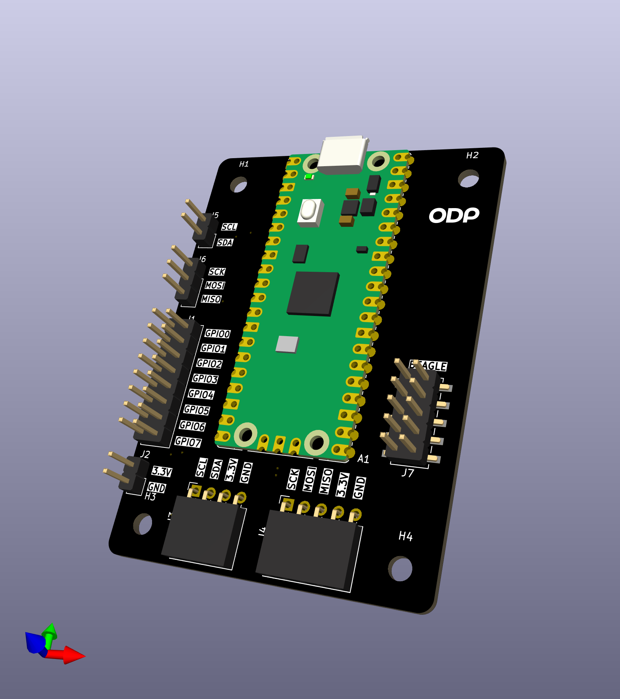
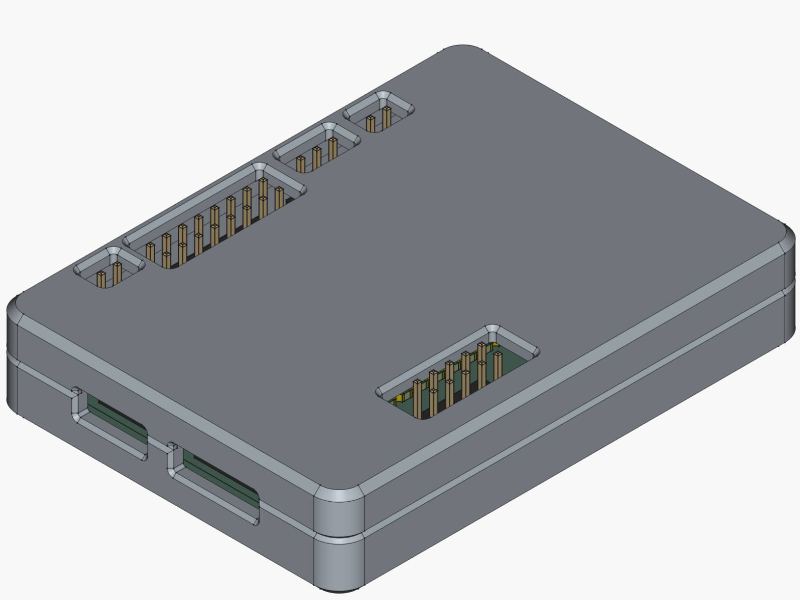

# Introduction

*Pico de Gallo* is an open hardware design built around the [Raspberry
Pi Pico2](https://www.raspberrypi.com/products/raspberry-pi-pico-2/)
board that turns a Pico 2 into a versatile USB bridge for embedded
development. It exposes the following interfaces to a host PC:

- **I²C** — read, write, write-read, bus scan, runtime frequency
  configuration, transaction batching
- **SPI** — read, write, transfer, flush, runtime mode/frequency
  configuration, transaction batching
- **UART** — read, write, flush, runtime baud/config changes
- **GPIO** — get, put, direction control, edge/level event subscription
- **PWM** — duty cycle control, enable/disable, frequency/config changes
- **ADC** — single-shot analog reads on 4 GPIO-based channels (12-bit)
- **1-Wire** — bus reset, read, write, ROM search (PIO hardware)
The `pico-de-gallo-hal` crate implements standard
[embedded-hal](https://docs.rs/embedded-hal) and
[embedded-hal-async](https://docs.rs/embedded-hal-async) traits, so
existing device drivers work out of the box — no code changes needed.

A companion **CLI application** (`gallo`) provides interactive access to
every interface.

In the following chapters we will look at the *Pico de Gallo* ecosystem
in detail: hardware assembly, the crate architecture, each supported
interface, writing device drivers, and the FFI/C bindings.

## The Hardware

At its most basic, *Pico de Gallo* is merely a landing board
containing Pico 2 castelated pads where a Pico 2 can be soldered
directly. This means that anything *Pico de Gallo* can do, can also be
achieved without *Pico de Gallo*'s landing board; however, the landing
board is a lot easier to work with, especially when it comes to
tracking which pins the Firmware expects you to use.

The assembled landing board also contains headers which allows for
connecting peripherals using DuPont wires.

You can get a feeling for how the board looks from the rendering
below:

## The Case

We also provide a 3D-printable (see below), snap-fit case where you
can house your *Pico de Gallo* if you so desire. It's entirely
optional.

